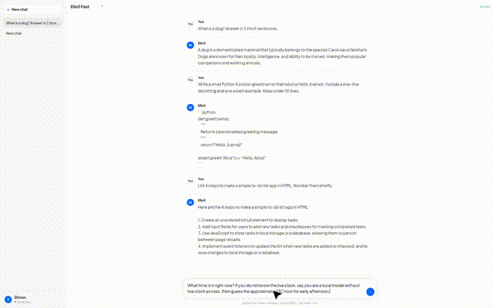
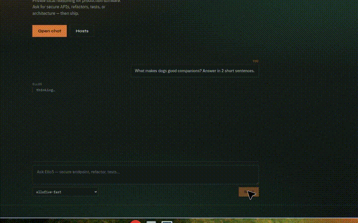

# ElloFive AI — Elite Coding System

Private local software-engineering AI on [Ollama](https://ollama.com), with [FRC7](https://github.com/EricksonAtHome/FRC7) FRCL, [DeepFakes](https://github.com/yeahreum/DeepFakes) deep learning, and an on-disk knowledge base.

**Elloten** is the chat UX on `ello5.com`. **Ello5** is the AI model. Local CLI stays `ellofive`.

## Elite Coding System

The model personality lives in [`models/elite-coding-system.md`](models/elite-coding-system.md) and is baked into `ellofive` via `scripts/build-modelfile.sh`.

It enforces production-ready code: self-review, SOLID/DRY/KISS, security (OWASP), tests, performance, GPU awareness, streaming, privacy-first defaults, and local memory.

## Models

| Name | Default base | Role |
| --- | --- | --- |
| `ellofive` | **qwen2.5:7b** | Elite Coding System (Pro) |
| `ellofive-fast` | llama3.2:3b | Low latency |
| `models5` | alias → Pro | FRC7 default |

Override Pro base: `ELLOFIVE_BASE_MODEL=qwen2.5:14b ellofive setup` (needs lots of RAM).

## Quick start

```bash
bash scripts/install.sh
# or rebuild models only:
ellofive setup

ellofive chat
ellofive chat "Write a secure FastAPI health endpoint with tests"

ellofive memory add "Prefer TypeScript strict mode"
ellofive memory show

ellofive frc examples/hello.frcl
ellofive dl smoke

# Elloten UI + Ello5 API
ellofive api
# → http://127.0.0.1:3000  (Elloten chat + /v1/chat + /run/:model)
```

## Ello5 domains (`ello5.com`)

| Host | Role |
| --- | --- |
| `ai.ello5.com` | Elloten chat UI/UX |
| `api.ello5.com` | REST API (`/v1/chat`, `/run/:model`) |
| `ft.svr.ello5.com` | Runtime front-tier (model serve) |
| `ello5.com` | Redirect → `ai.ello5.com` |

Full map + DNS: [`docs/domains.md`](docs/domains.md). Deploy: [`deploy/Caddyfile`](deploy/Caddyfile).

```bash
# Chat via API
curl -s http://127.0.0.1:3000/v1/chat \
  -H 'Content-Type: application/json' \
  -d '{"message":"Write a secure health endpoint"}'
```

## Test demo

### How Elloten works (live)

Real **Elloten** session with **Ello5 Fast** — normal question → write code → do a task → ask time → ask news:

[](docs/elloten-live-demo.mp4)

[Watch live demo (MP4)](docs/elloten-live-demo.mp4) · [Transcript](docs/elloten-live-demo-transcript.md)

Prompts covered:

1. Normal Q — What is a dog?  
2. Create code — Python `greet(name)`  
3. Do a task — HTML to-do app steps  
4. Ask time — live clock (model explains limits)  
5. Ask news — tech headline / known past story  

```bash
ellofive serve
ellofive api   # open http://127.0.0.1:3000
```

### Earlier UI smoke

[](docs/ello5-ai-mode-demo.mp4)

[Watch earlier demo (MP4)](docs/ello5-ai-mode-demo.mp4) · [Transcript](docs/ello5-ai-mode-demo-transcript.md)

### CLI / FRC smoke

[](docs/ellofive-test-demo.mp4)

[Watch full demo (MP4)](docs/ellofive-test-demo.mp4)

## What you get

| Piece | Purpose |
| --- | --- |
| `models/elite-coding-system.md` | Elite coding personality source |
| `ellofive` / `ellofive chat` | Pro chat with local memory injection |
| `ellofive memory` | Private on-disk knowledge base |
| `frc/` | FRCL → real local inference |
| `web/` | **Elloten** chat UX (Ello5 model) |
| `ellofive api` | Elloten + API gateway for `ai` / `api.ello5.com` |
| `deeplearning/DeepFakes` | Deep learning toolkit |
| `memory/knowledge-base.md` | Durable preferences & decisions |

## Privacy

Default mode is offline/local. Memory stays in `memory/` on your machine. No hidden telemetry.

## Test

```bash
npm install
npm test
```

## Deep learning (DeepFakes)

```bash
ellofive dl setup
ellofive dl smoke
```

Consenting subjects / lawful use only. See [`deeplearning/README.md`](deeplearning/README.md).

## Customize the Elite System

```bash
$EDITOR models/elite-coding-system.md
bash scripts/build-modelfile.sh
ellofive setup
```

## Credits

- Runtime: [Ollama](https://ollama.com)
- FRCL: [EricksonAtHome/FRC7](https://github.com/EricksonAtHome/FRC7)
- Deep learning: [yeahreum/DeepFakes](https://github.com/yeahreum/DeepFakes)
